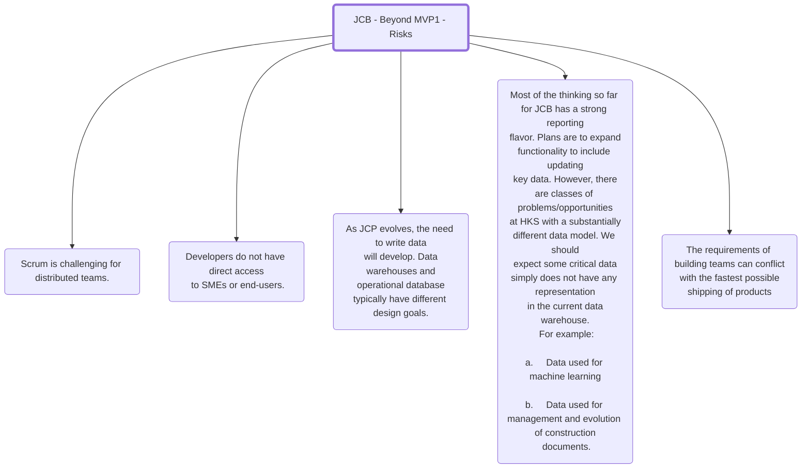

```mermaid
graph TB 
    a(JCB - Beyond MVP1 - Risks) --> b(Scrum is challenging for distributed teams.)
    a --> c(Developers do not have direct access<br> to SMEs or end-users.)
    a --> d(As JCP evolves, the need to write data<br> will develop. Data warehouses and<br> operational database typically have different design goals.)
    a --> e("Most of the thinking so far for JCB has a strong reporting<br> flavor. Plans are to expand functionality to include updating<br> key data. However, there are classes of problems/opportunities<br> at HKS with a substantially different data model. We should<br> expect some critical data simply does not have any representation<br> in the current data warehouse.<br> For example:<br>
a.	Data used for machine learning<br>
b.	Data used for management and evolution of construction<br> documents.")
a --> f(The requirements of building teams can conflict<br> with the fastest possible shipping of products)

style a stroke-width:4px
```