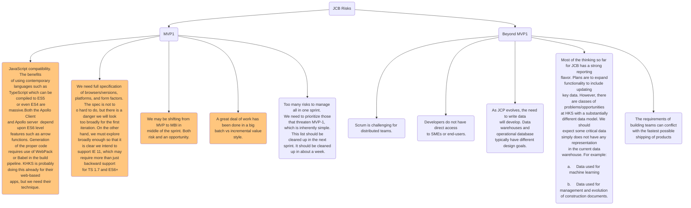

#### JCB Risks
---

```mermaid
graph TB 
    a(JCB Risks) --> b(MVP1)
a --> c(Beyond MVP1)
b --> d(JavaScript compatibility. The benefits<br> of using contemporary languages such as<br> TypeScript which can be compiled to ES5<br>  or even ES4 are massive.Both the Apollo Client<br> and Apollo server  depend upon ES6 level<br> features such as arrow functions. Generation<br>  of the proper code requires use of WebPack<br> or Babel in the build pipeline. KHKS is probably<br> doing this already for their web-based<br> apps, but we need their technique.)
b --> e(We need full specification of browsers/versions, <br>platforms, and form factors. The spec is not to<br>o hard to do, but there is a danger we will look<br> too broadly for the first iteration. On the other<br> hand, we must explore broadly enough so that it<br> is clear we intend to support IE 11, which may<br> require more than just backward support<br> for TS 1.7 and ES6+)
b --> f(We may be shifting from MVP to MBI in<br> middle of the sprint. Both risk and an opportunity.)
b --> g(A great deal of work has been done in a big<br> batch vs incremental value style.)
b --> h(Too many risks to manage all in one sprint. <br> We need to prioritize those that threaten MVP-1, <br> which is inherently simple. This list should be<br> cleared up in the next sprint. It should be cleaned<br> up in about a week.)
c --> i(Scrum is challenging for distributed teams.)
c --> j(Developers do not have direct access<br> to SMEs or end-users.)
c --> k(As JCP evolves, the need to write data<br> will develop. Data warehouses and<br> operational database typically have different design goals.)
c --> l("Most of the thinking so far for JCB has a strong reporting<br> flavor. Plans are to expand functionality to include updating<br> key data. However, there are classes of problems/opportunities<br> at HKS with a substantially different data model. We should<br> expect some critical data simply does not have any representation<br> in the current data warehouse. For example:<br>
a.	Data used for machine learning<br>
b.	Data used for management and evolution of construction documents.")
c --> m(The requirements of building teams can conflict<br> with the fastest possible shipping of products)

style d fill:#FFC67E 

style e fill:#FFC67E 

style f fill:#FFC67E

style g fill:#FFC67E
```

Orange = Risks have been mitigated
