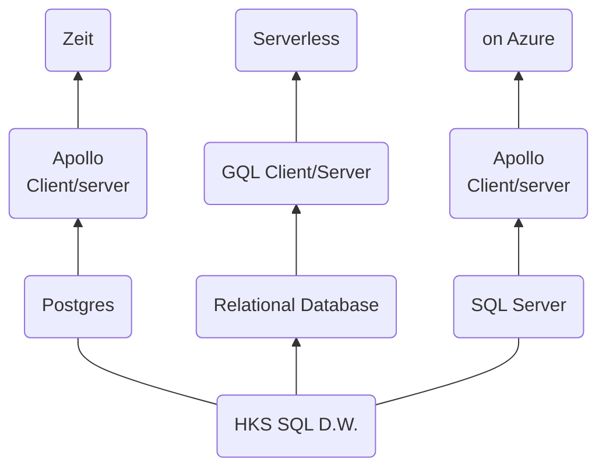

```mermaid
graph BT;
    A(HKS SQL D.W.)---E(Postgres);
    A-->B(Relational Database);
    A---H(SQL Server);
    E-->F(Apollo<br> Client/server);
    B-->C(GQL Client/Server);
    H-->I(Apollo<br> Client/server);
    F-->G(Zeit);
   C-->D(Serverless);
    I-->J(on Azure);
```