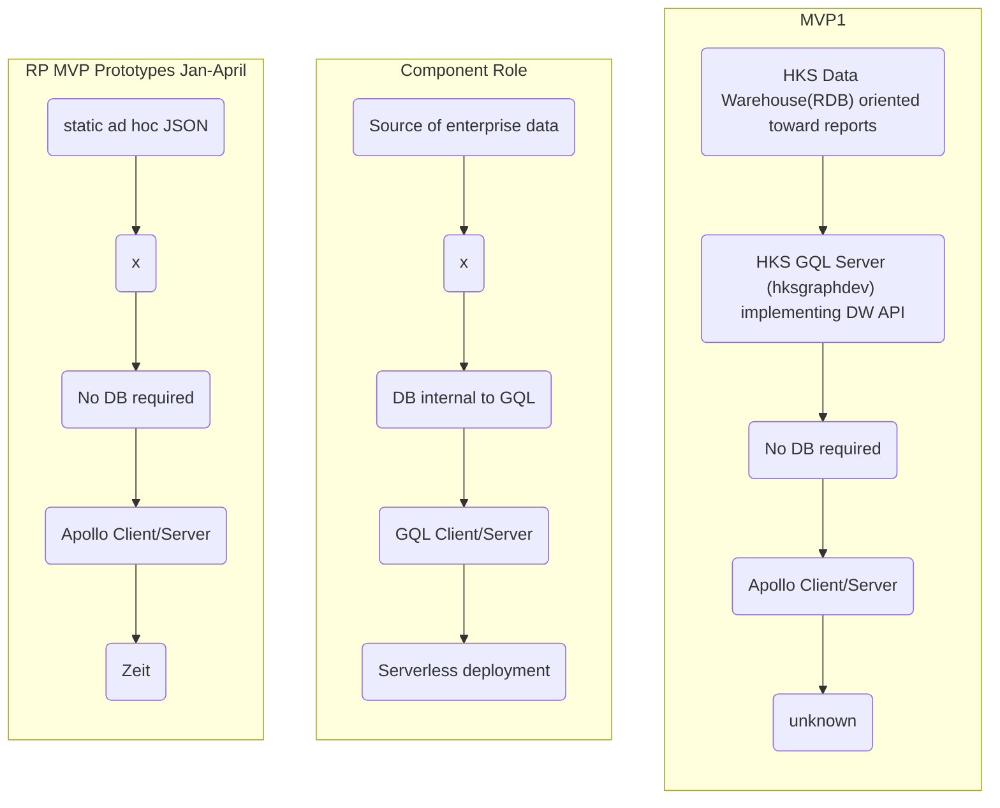

```mermaid
graph BT;
subgraph MVP1
a("HKS Data Warehouse(RDB) oriented toward reports") --> b("HKS GQL Server (hksgraphdev) implementing DW API");
b --> c(No DB required);
c --> d(Apollo Client/Server);
d --> e(unknown);
end
subgraph Component Role
f(Source of enterprise data) --> g(x);
g --> h(DB internal to GQL);
h --> i(GQL Client/Server);
i --> j(Serverless deployment);
end
subgraph RP MVP Prototypes Jan-April
k(static ad hoc JSON) --> l(x);
l --> m;
m(No DB required) --> n(Apollo Client/Server);
n --> o(Zeit);
end
```