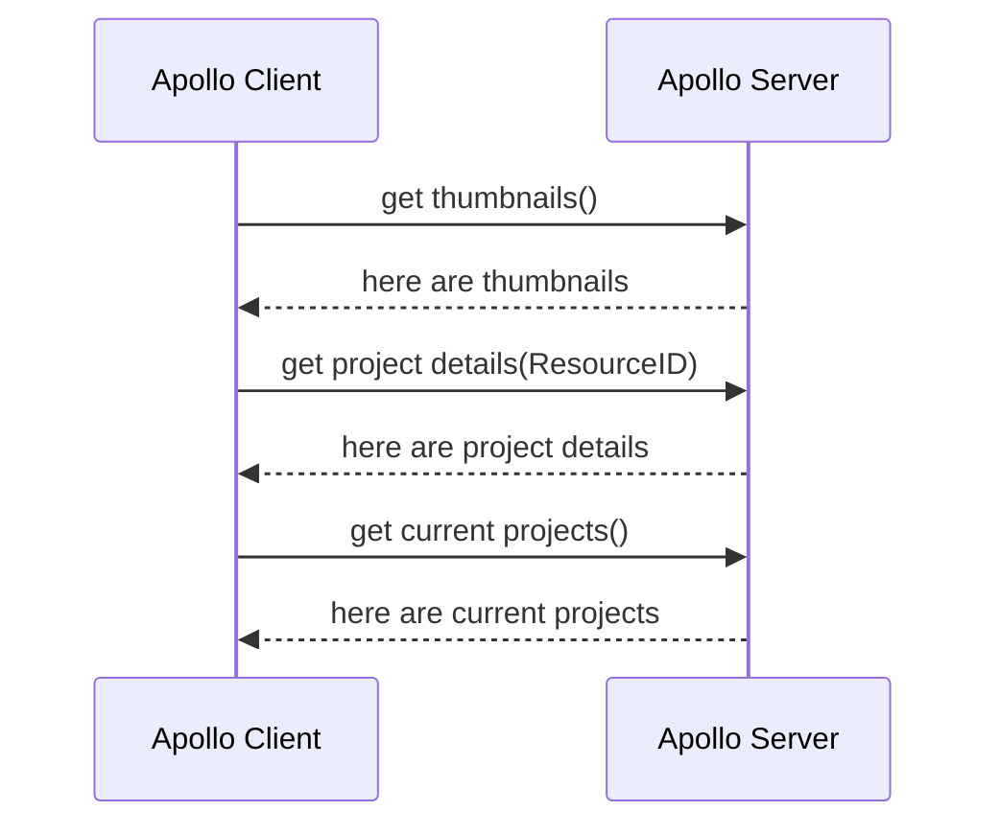
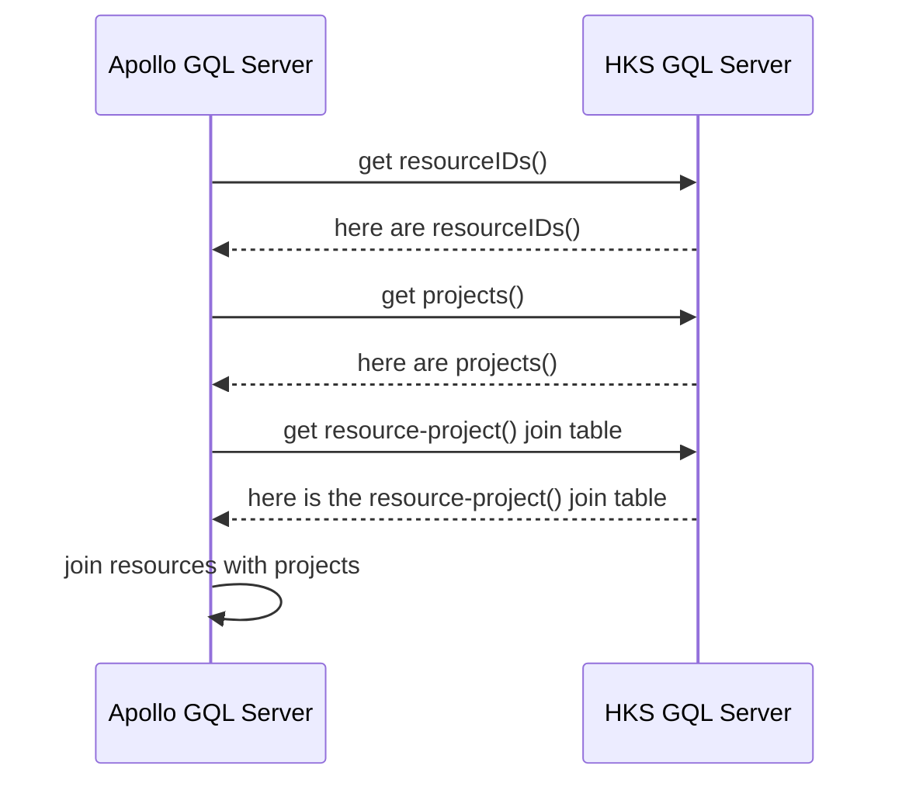
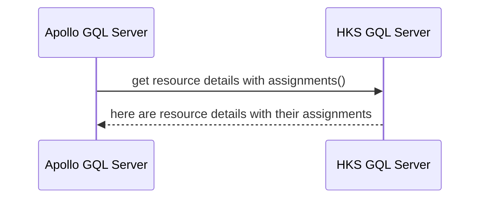

# **Data Flow**

## 1. Apollo Current

```mermaid
sequenceDiagram
    Apollo Client->>Apollo Server: get thumbnails()
    Apollo Server-->>Apollo Client: here are thumbnails
    Apollo Client->>Apollo Server: get project details(ResourceID)
    Apollo Server-->>Apollo Client: here are project details
    Apollo Client->>Apollo Server: get current projects()
    Apollo Server-->>Apollo Client: here are current projects
```

## 2. In Reference to Johns Current Drawing
* it is complex
* it requires a join in Javascript

```mermaid
sequenceDiagram
    Apollo GQL Server->>HKS GQL Server: get resourceIDs()
    HKS GQL Server-->>Apollo GQL Server: here are resourceIDs()
    Apollo GQL Server->>HKS GQL Server: get projects()
    HKS GQL Server-->>Apollo GQL Server: here are projects()
    Apollo GQL Server->>HKS GQL Server: get resource-project() join table
    HKS GQL Server-->>Apollo GQL Server: here is the resource-project() join table
    Apollo GQL Server->>Apollo GQL Server: join resources with projects
```

## 3. Proposed API
* join is done in SQL server

```mermaid
sequenceDiagram
    Apollo GQL Server->>HKS GQL Server: get resource details with assignments()
    HKS GQL Server-->>Apollo GQL Server: here are resource details with their assignments
```