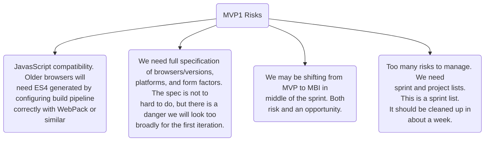

```mermaid
graph TB 
    a(MVP1 Risks) --> b(JavasScript compatibility. Older browsers will<br>need ES4 generated by configuring build pipeline<Br> correctly with WebPack or similar)
    a --> c(We need full specification of browsers/versions,<br>platforms, and form factors. The spec is not to<br>hard to do, but there is a danger we will look too<br>broadly for the first iteration.)
    a --> d(We may be shifting from MVP to MBI in<br> middle of the sprint. Both risk and an opportunity.)
    a --> e(Too many risks to manage. We need<br> sprint and project lists. This is a sprint list.<br> It should be cleaned up in about a week.)
```