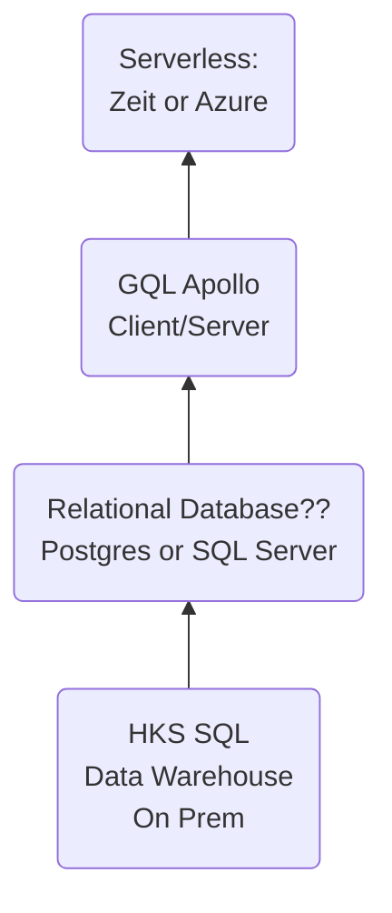

```mermaid
graph BT;
    A(HKS SQL<br> Data Warehouse<br> On Prem)--> B(Relational Database??<br> Postgres or SQL Server)
    B --> C(GQL Apollo<br> Client/Server)
    C --> D(Serverless:<br>Zeit or Azure)
```