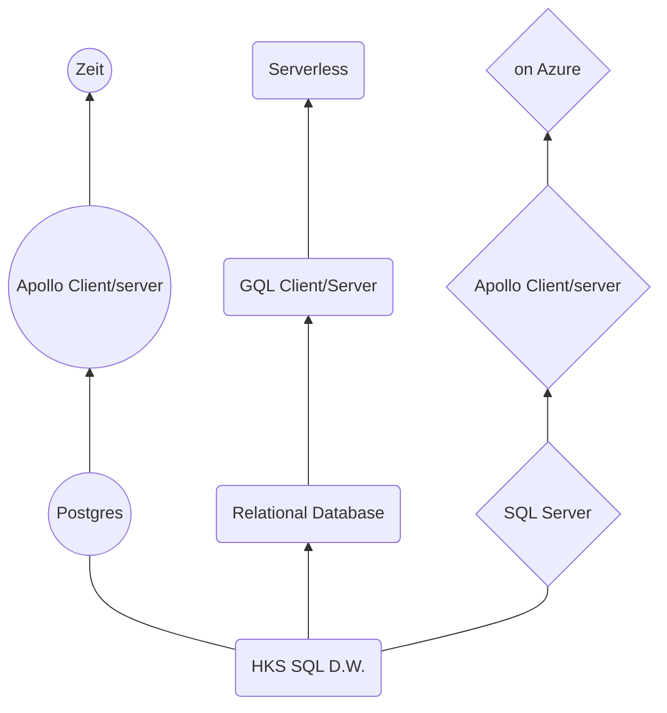

```mermaid
graph BT;
    A(HKS SQL D.W.)---E((Postgres));
    A-->B(Relational Database);
    A---H{SQL Server};
    E-->F((Apollo Client/server));
    B-->C(GQL Client/Server);
    H-->I{Apollo Client/server};
    F-->G((Zeit));
   C-->D(Serverless);
    I-->J{on Azure}; 

```