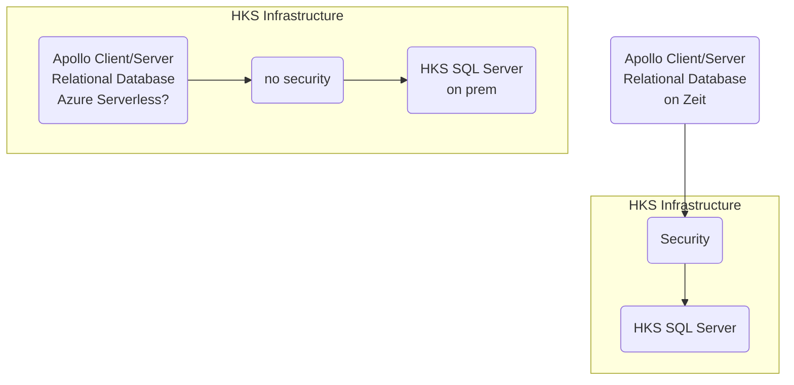

```mermaid
graph TD;
a(Apollo Client/Server<br>Relational Database<br>on Zeit) --> b(Security);
subgraph HKS Infrastructure
b --> c(HKS SQL Server);
end
subgraph HKS Infrastructure
e(Apollo Client/Server<br>Relational Database<br>Azure Serverless?) --> g(no security);
g --> h(HKS SQL Server<br>on prem);
end
```